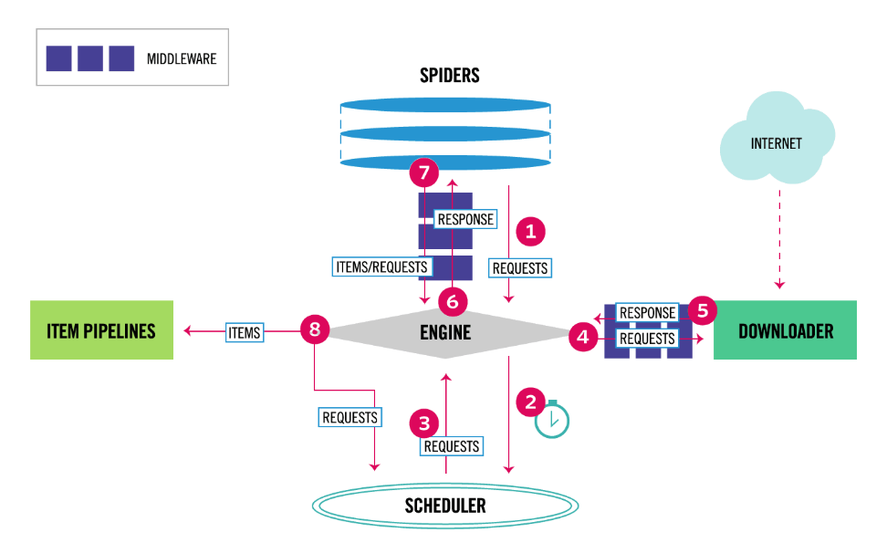

## 实习生培养计划

### 1. 项目背景

- Web-Scraping项目架构图

  

- 原先系统的不足

  [参考地址](/原先系统的不足.md)

### 2. 知识储备

1. python3基础

   - 时间：5天

   - 知识点：

     - 了解python3的语法，[推荐链接](https://www.liaoxuefeng.com/wiki/0014316089557264a6b348958f449949df42a6d3a2e542c000)
     - 了解常用的library，如requests，re，Xpath，BeautifulSoup等
     - 了解数据存储，TXT文本存储、MongoDB存储

   - 练习：使用python3写一个爬虫，这里不需要用任何框架

     网站URL：`https://www.cia.gov/library/publications/world-leaders-1/` 

     输出格式：`country|title|name`

2. scrapy框架

   - 时间：3天

   - 知识点：

     - 了解scrapy框架的工作流程，架构图如下：

       

     - 了解scrapy框架各个组件的作用

       - Engine
       - Scheduler
       - Spiders
       - Item Pipeline
       - Downloader middlewares
       - Spider middlewares

     - 了解环境配置以及相关库的安装

   - 练习：使用scrapy框架写一个爬虫

     网站URL：`https://www.cia.gov/library/publications/world-leaders-1/`

     输出格式：`country|title|name`

3. 分布式爬虫

   - 时间：1天
   - 知识点：
     - 了解分布式爬虫原理
     - 了解采用redis如何实现scrapy分布式
   - 练习：将上面的scrapy爬虫改成分布式爬虫

4. 分布式部署

   - 时间：1天
   - 知识点：
     - 了解scrapyd分布式部署
     - 了解Gerapy分布式管理框架
   - 练习：将上面的scrapy分布式爬虫使用Gerapy管理框架部署到两台机器上

**小结：** 通过以上的知识点的学习以及练习，应该对这个新的爬虫框架有了一定的了解，并且能够熟练的使用，接下来就是完成对Blacklist脚本的迁移。

### 3. 实战

- 时间：一周

- Blacklist脚本迁移到scrapy框架 (我罗列了部分在下面)
  - BL_Chiefs_of_State: `https://www.cia.gov/library/publications/world-leaders-1`
  - BL_ICEFugitivesList: `https://www.ice.gov/most-wanted`
  - BL_US_Marshall_Most_Wanted: `https://www.usmarshals.gov/profiled.htm`
  - BL_FBI_Seeking_Information: `https://www.fbi.gov/wanted/seeking-information`
  - BL_Fincen_BlackList: `https://www.fincen.gov/financial_institutions/msb/msbstateselector.html`

### 4. 扩展

- IP池的管理
- cookie池的管理
- 基于scrapy的微博数据的抓取
- 运用Splash异步抓取

